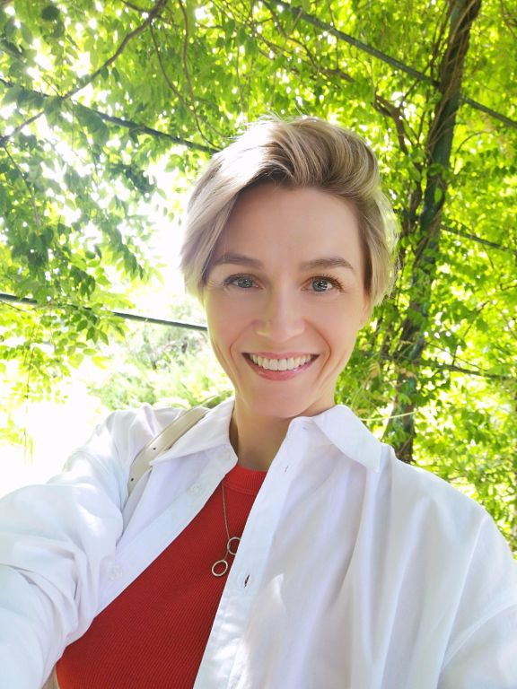

# Labs_PSTU_Siniagina_RIS-26-4b
## Синягина Надежда
*Студентка группы РИС-26-4б*

#### Кредо ####
>Всегда выбирайте самый трудный путь — на нем вы не встретите конкурентов - Шарль де Голль

Обо мне:
  1. есть красный диплом ПИ(ф)РГТУ 2006г.
  2. запускала Пермские Термы как CEO, где-то на РБК есть [интервью](https://vk.ru/wall-122022858_27936) со мной.
  3. скоро лечу в командировку в Китай, а может и отделаюсь).
  4. треню 5 раз в неделю: обожаю тай-бо.
  5. не чувствую никакие запахи уже 23 года - ЗЧМТ.
  6. Прошла "миллион" всяких тренингов и читала сама по фин.моделированию.
  7. Люблю учиться. Ученье - свет. Не боюсь деменции, пока.
  8. Мои питомцы - две крысы в клетке и черепаха в аквариуме.

## Успехи на 27.09.2026

| № | Задача | Статус |
|---|--------|--------|
| 1 | Настройка Git и SSH | Готово (вместе с DeepSeek) |
| 2 | Первый репозиторий | Готово (сама + ребята из группы помогли) |
| 3 | Ветки и слияние | Готово (вместе с DeepSeek) |
| 4 | Фото | Готово (почти сама) |
| 5 | Лабораторная 0 | В работе |
| 6 | README с описанием | Готово (сама) |
